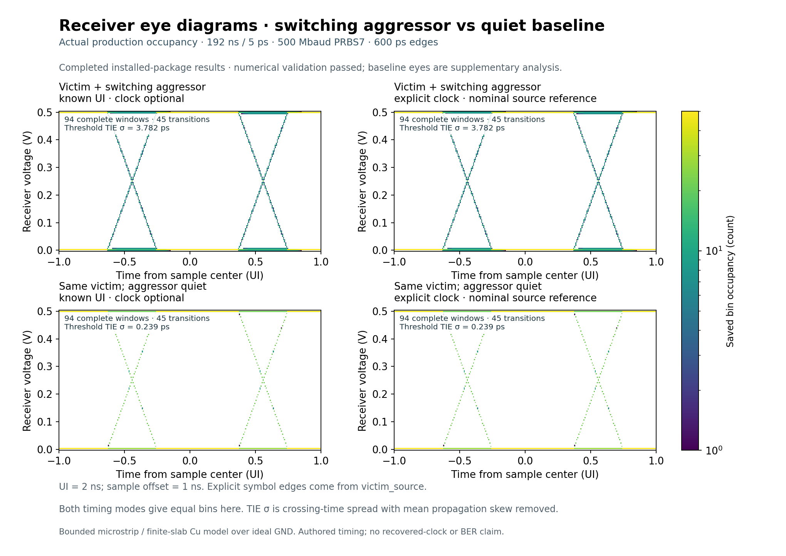
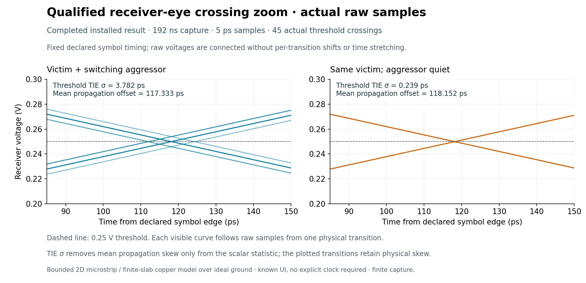
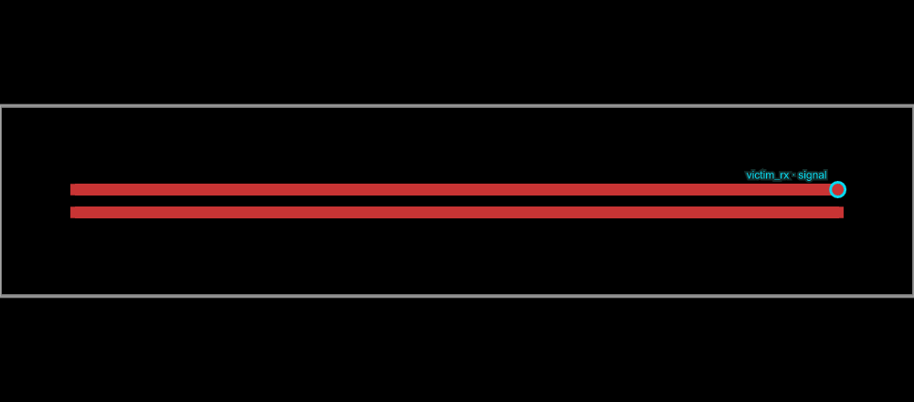
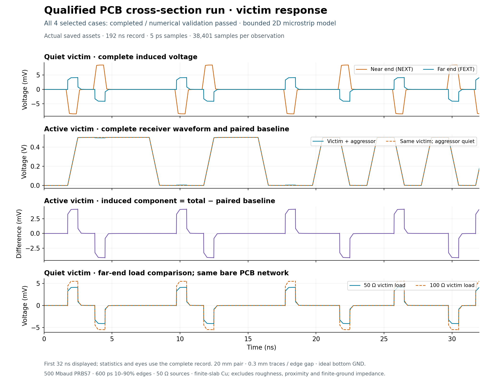

# simulate-pcb-noise

See how a switching PCB trace disturbs its neighbor, and how that changes the receiver eye.
This package computes waveform, eye-diagram and spectrum **data** from Circuit JSON; [circuit-to-svg](https://github.com/tscircuit/circuit-to-svg/pull/820) turns those results into plots. The current solver models two straight, equal-width parallel traces over ideal ground.



The same receiver is shown with **known UI, without a clock**, and an **authored symbol clock**. The lower row quiets only the aggressor. Both timing choices agree in this example; the authored clock is a nominal reference. Baseline eyes are supplementary analysis of the paired waveform data. [Open the image at full size](docs/images/receiver-eye-comparison.png).

| Computed for this capture | Switching aggressor | Quiet-aggressor baseline |
| --- | ---: | ---: |
| Crossing-time standard deviation σ | 3.782 ps | 0.239 ps |
| Complete eye windows | 94 | 94 |
| Threshold crossings | 45 | 45 |

The eyes cover 192 ns at 500 Mbaud. The σ removes constant mean delay; the plotted transitions keep their physical delay. These are finite-record simulation metrics, without a BER prediction.



The close-up makes the crosstalk-induced timing spread visible near the 0.25 V receiver threshold. These are the same raw sampled transitions, folded against fixed symbol timing. The comparison figures use Matplotlib to present the saved solver data; the PCB view below is rendered by circuit-to-svg.

## What this repository does


The solver extracts a two-trace cross-section, evaluates its coupled transmission-line network, and saves full-resolution voltage/current assets. Paired runs preserve the victim and quiet the aggressor, so `difference = total − baseline` isolates induced noise. Every completed result records input hashes, settings, model assumptions and numerical checks.

The current provider supports **two equal-width, straight, coextensive parallel top traces over ideal continuous ground**, with explicit dielectric and copper properties. The implementation is in [PR #1](https://github.com/tscircuit/simulate-pcb-noise/pull/1); [model and API details](docs/model-and-api.md) describe its limits and CLI.

## The example board



Two 20 mm × 0.3 mm traces have a 0.3 mm edge gap, over a bottom ground plane. This top view marks the victim receiver contact; the ground plane is below it. The example explicitly supplies 35 µm copper, a 0.2 mm dielectric with εᵣ = 4.2, and 50 Ω sources.



The quiet victim reaches **8.473 mV near end** and **4.143 mV far end**. In the quiet-victim case, changing its load from 50 Ω to 100 Ω changes the waveform by up to **1.442 mV**, using the same extracted PCB network.

## Run the example

Use Bun and Node 24. The [four-case demo](https://github.com/tscircuit/return-current-trace-demo/tree/codex/pcb-noise-demo/examples/circuit-json/two-line-pcb-noise) pins the verified, unreleased package previews:

```sh
git clone --branch codex/pcb-noise-demo https://github.com/tscircuit/return-current-trace-demo.git
cd return-current-trace-demo/examples/circuit-json/two-line-pcb-noise
bun install --frozen-lockfile
bun run typecheck
bun run demo ./work/pcb-noise
```

It writes Circuit JSON results, full-resolution assets and selected **eye, waveform, spectrum and PCB-contact SVG/PNG images**. Use a fresh output directory for each run. The [demo README](https://github.com/tscircuit/return-current-trace-demo/blob/codex/pcb-noise-demo/examples/circuit-json/two-line-pcb-noise/README.md) explains the generated files.

## Request an eye in TSX

Inside an existing `simulation.pcbnoisesimulation` with an active PRBS `victim` channel:

```tsx
import { simulation } from "@tscircuit/core"

<simulation.pcbnoiseeye
  channel="victim"
  timing={{ kind: "known_ui", unitInterval: "2ns", epoch: "0ns", sampleOffset: "1ns" }}
/>
```

For the authored victim symbol clock, use `timing={{ kind: "source", channel: "victim", sampleOffset: "1ns" }}`. The [props PR](https://github.com/tscircuit/props/pull/927) shows the complete compact TSX, including physical contacts, source/load values and paired baseline. Fabrication stackup and solver settings are supplied separately.

## Scope and verification

This is a quasi-TEM coupled-line model with constant permittivity, zero dielectric loss and finite-slab copper loss. It does not model arbitrary routing, vias, launches, finite-ground impedance, dielectric dispersion, copper roughness or PCB-derived supply noise. Numerical convergence checks the stated model; hardware accuracy remains uncalibrated. Standalone authored power/noise utilities are described in the [API details](docs/model-and-api.md#physical-scope).

The implemented solver passed **157 local tests**, typecheck, build and clean browser/Node/CLI consumer checks. All four installed demo cases passed their numerical and asset-integrity checks. [Image provenance](docs/images/provenance.json) identifies the real verified data behind the figures.
